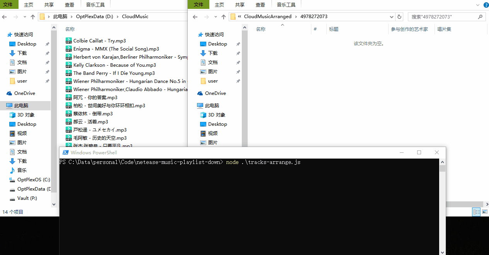

# 163Music歌单工具

## 自动整理PC客户端下载的歌曲

> 根据歌单序号自动排序



1. 打开 tracks-arrange.js，修改参数：

   ```
   fromDir: 'D:\\CloudMusic\\', // 163MusicPC客户端下载文件夹
   toDir: 'D:\\CloudMusicArranged\\', // 目标文件夹
   playlistID: '4978272073' // 歌单ID
   ```

2. `node tracks-arrange.js`
